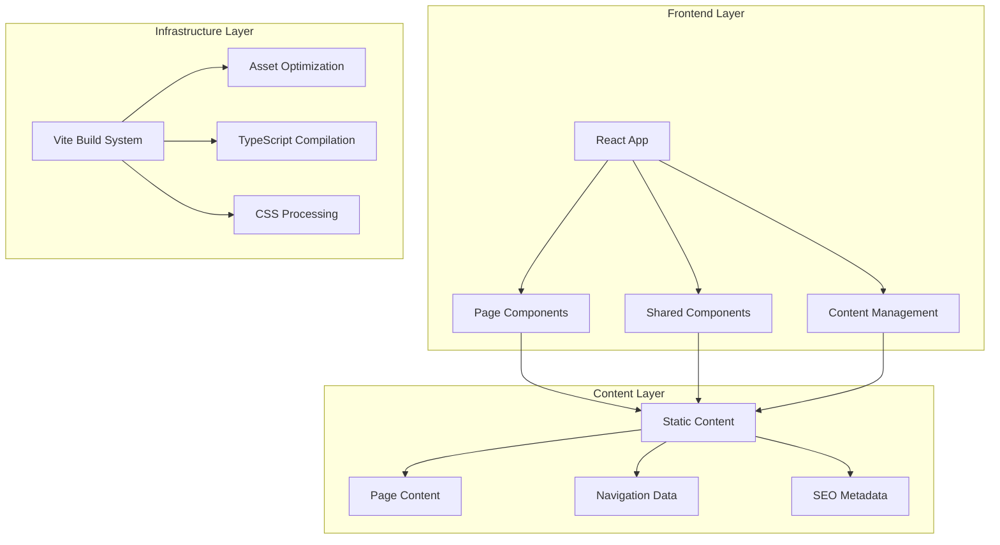
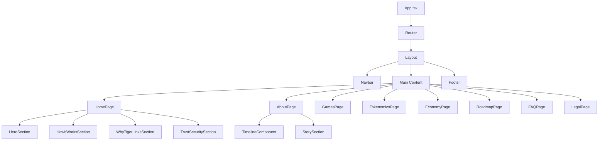

# Design Document: TigerLinks Website Overhaul

## Overview

The TigerLinks website overhaul transforms a meme coin-focused site into a professional game-first Web3 ecosystem platform. This design emphasizes user experience, content management flexibility, and technical excellence while maintaining the existing React/TypeScript/Vite technology stack.

The transformation addresses three core areas:
1. **Content Strategy**: Systematic replacement of meme coin messaging with game-first narrative
2. **Information Architecture**: Restructured navigation and content organization based on user intent
3. **Technical Infrastructure**: Enhanced content management, SEO optimization, and performance improvements

## Architecture

### High-Level System Architecture



### Content Management Strategy

The design implements a **hybrid content management approach** that balances flexibility with maintainability:

- **Static Content Files**: JSON/TypeScript modules for structured content (navigation, timelines, FAQs)
- **Component-Embedded Content**: Direct content within React components for simple, stable text
- **Centralized Content Registry**: Single source of truth for all content references and metadata

This approach enables rapid content updates while maintaining type safety and developer experience.

### Navigation Architecture

The navigation system implements a **dual-path architecture** based on user intent:

**Primary Path (Player-Focused)**:
- Prominent placement in main navigation
- Optimized for discovery and engagement
- Minimal friction to core actions

**Secondary Path (Token-Focused)**:
- Footer and secondary navigation placement
- Comprehensive information for informed users
- Clear separation from gaming content

## Components and Interfaces

### Core Component Structure

```typescript
// Content Management Interface
interface ContentManager {
  getPageContent(pageId: string): PageContent;
  getNavigationData(): NavigationStructure;
  getSEOMetadata(pageId: string): SEOMetadata;
  updateContent(pageId: string, content: Partial<PageContent>): void;
}

// Page Content Structure
interface PageContent {
  id: string;
  title: string;
  subtitle?: string;
  sections: ContentSection[];
  metadata: PageMetadata;
}

// Navigation Structure
interface NavigationStructure {
  primary: NavigationItem[];
  secondary: NavigationItem[];
  footer: NavigationItem[];
}

// SEO Metadata
interface SEOMetadata {
  title: string;
  description: string;
  keywords: string[];
  ogTitle: string;
  ogDescription: string;
  schema: SchemaMarkup;
}
```

### Component Hierarchy



### Reusable Component Library

**Content Components**:
- `<ContentSection>`: Flexible section wrapper with consistent styling
- `<Timeline>`: Reusable timeline component for About page and Roadmap
- `<FeatureGrid>`: Grid layout for features, benefits, and proof points
- `<CTAButton>`: Consistent call-to-action styling and behavior

**Layout Components**:
- `<PageHeader>`: Standardized page headers with title and subtitle
- `<SectionContainer>`: Consistent section spacing and responsive behavior
- `<ContentGrid>`: Responsive grid system for content organization

**Interactive Components**:
- `<NavigationMenu>`: Responsive navigation with mobile support
- `<DownloadButton>`: Whitepaper and document download functionality
- `<ExternalLink>`: Consistent external link handling with security

## Data Models

### Content Data Structure

```typescript
// Timeline Entry Model
interface TimelineEntry {
  id: string;
  period: string;
  title: string;
  description: string;
  highlights?: string[];
}

// FAQ Entry Model
interface FAQEntry {
  id: string;
  question: string;
  answer: string;
  category: 'gameplay' | 'tokens' | 'technical' | 'legal';
}

// Roadmap Milestone Model
interface RoadmapMilestone {
  id: string;
  status: 'now' | 'next' | 'later';
  title: string;
  description: string;
  features: string[];
}

// Trust & Security Item Model
interface SecurityItem {
  id: string;
  type: 'audit' | 'anti-abuse' | 'transparency';
  title: string;
  status: 'complete' | 'in-progress' | 'planned';
  description: string;
  link?: string;
}
```

### SEO and Metadata Models

```typescript
// Schema Markup Model
interface SchemaMarkup {
  '@context': 'https://schema.org';
  '@type': 'Organization' | 'SoftwareApplication';
  name: string;
  description: string;
  url: string;
  applicationCategory?: string;
  operatingSystem?: string;
}

// Page Metadata Model
interface PageMetadata {
  slug: string;
  lastModified: Date;
  priority: number;
  changeFrequency: 'daily' | 'weekly' | 'monthly';
  canonicalUrl: string;
}
```

### Content Registry Model

```typescript
// Central Content Registry
interface ContentRegistry {
  pages: Record<string, PageContent>;
  navigation: NavigationStructure;
  globalContent: {
    brandName: string;
    tokenName: string;
    taglines: Record<string, string>;
    legalDisclaimer: string;
  };
  seoDefaults: SEOMetadata;
}
```

Now I need to use the prework tool to analyze the acceptance criteria before writing the Correctness Properties section.

<function_calls>
<invoke name="prework">
<parameter name="featureName">tigerlinks-website-overhaul

## Correctness Properties

*A property is a characteristic or behavior that should hold true across all valid executions of a system—essentially, a formal statement about what the system should do. Properties serve as the bridge between human-readable specifications and machine-verifiable correctness guarantees.*

### Property Reflection

After analyzing all acceptance criteria, several properties can be consolidated to eliminate redundancy:

- **Content Transformation Properties (1.1, 1.2)**: Can be combined into a single comprehensive content transformation property
- **Content Filtering Properties (1.4, 1.5, 9.1, 9.2, 9.3)**: Can be consolidated into a comprehensive content compliance property  
- **SEO Properties (7.1, 7.2, 7.3)**: Can be combined into a single SEO metadata property
- **Bot Access Properties (8.2, 8.3)**: Can be consolidated into a single crawler access property

### Core Properties

**Property 1: Brand Name Consistency**
*For any* content rendered by the system, all brand name references should use exactly "TigerLinks" with consistent casing, replacing any variants like "TigerLinkz" or "Tigerlinkz"
**Validates: Requirements 1.1, 1.3**

**Property 2: Token Reference Transformation**  
*For any* content containing token references, all "$TGBW" instances should be replaced with "TigerLinks Token"
**Validates: Requirements 1.2**

**Property 3: Content Compliance Filtering**
*For any* rendered content, prohibited terms including meme coin terminology ("meme", "degenerate", "hype-coin"), aggressive language ("torch scam coins", "massive rewards"), gambling language, and profit guarantees should not appear
**Validates: Requirements 1.4, 1.5, 9.1, 9.2, 9.3**

**Property 4: Timeline Entry Formatting**
*For any* timeline entry displayed on the site, it should have proper heading structure and description formatting consistent with the approved timeline format
**Validates: Requirements 3.5**

**Property 5: Market Cap Conditional Display**
*For any* market cap data that is not real-time, the system should remove the market cap display entirely rather than showing stale data
**Validates: Requirements 5.1**

**Property 6: Token Utility Verification**
*For any* token utility displayed in lists, only verified and currently active features should be shown
**Validates: Requirements 5.4**

**Property 7: SEO Metadata Consistency**
*For any* page metadata (titles, descriptions, Open Graph data), content should emphasize game-first positioning and avoid token speculation language
**Validates: Requirements 7.1, 7.2, 7.3**

**Property 8: H1 Tag Uniqueness**
*For any* page rendered by the system, there should be exactly one H1 tag present
**Validates: Requirements 7.5**

**Property 9: Crawler Access Permissions**
*For any* bot request to the system, legitimate crawlers should receive appropriate content without being blocked, while maintaining security
**Validates: Requirements 8.2, 8.3**

**Property 10: Game Feature Emphasis**
*For any* game feature description, content should emphasize skill-based mechanics and avoid speculation-focused language
**Validates: Requirements 9.4**

## Error Handling

### Content Transformation Errors

**Missing Content Handling**:
- Graceful degradation when content files are missing or malformed
- Default fallback content for critical sections
- Error boundaries to prevent complete page failures

**Invalid Content Detection**:
- Validation of content against prohibited terms before rendering
- Automatic flagging of content that violates compliance rules
- Logging and alerting for content that requires manual review

### Navigation and Routing Errors

**404 Error Handling**:
- Custom 404 page with navigation back to main sections
- Automatic redirects for common URL patterns from old site structure
- Search functionality to help users find intended content

**Broken Link Detection**:
- Automated checking of internal and external links
- Graceful handling of temporarily unavailable external resources
- User-friendly error messages for broken downloads or resources

### SEO and Metadata Errors

**Missing Metadata Fallbacks**:
- Default SEO metadata when page-specific data is unavailable
- Automatic generation of meta descriptions from page content
- Schema markup validation and error reporting

**Crawler Access Issues**:
- Monitoring and alerting for blocked legitimate crawlers
- Automatic recovery from robots.txt configuration errors
- Logging of unusual crawler behavior for security analysis

## Testing Strategy

### Dual Testing Approach

The testing strategy employs both **unit testing** and **property-based testing** as complementary approaches:

**Unit Tests** focus on:
- Specific content examples and edge cases
- Integration points between components  
- Error conditions and boundary cases
- Specific UI element presence and behavior

**Property Tests** focus on:
- Universal content transformation rules
- Comprehensive input coverage through randomization
- Content compliance across all possible inputs
- SEO and metadata consistency patterns

### Property-Based Testing Configuration

**Testing Framework**: Fast-check (for TypeScript/JavaScript property-based testing)
**Test Configuration**: Minimum 100 iterations per property test
**Test Tagging**: Each property test must reference its design document property using the format:
`// Feature: tigerlinks-website-overhaul, Property {number}: {property_text}`

### Unit Testing Focus Areas

**Content Verification Tests**:
- Homepage displays correct headlines and CTAs
- About page contains approved timeline content
- Navigation menus contain required items
- New pages (Economy, FAQ, Legal) exist with required content

**Component Integration Tests**:
- Content management system properly loads and displays content
- Navigation system correctly routes between pages
- SEO metadata is properly applied to all pages
- Download functionality works for whitepapers and documents

**Error Condition Tests**:
- Graceful handling of missing content files
- Proper 404 error page display
- Broken link detection and handling
- Invalid content detection and filtering

### Performance and Accessibility Testing

**Performance Requirements**:
- Page load times under 3 seconds on standard connections
- Lighthouse performance scores above 90
- Optimized asset loading and caching strategies

**Accessibility Compliance**:
- WCAG 2.1 AA compliance for all interactive elements
- Proper heading hierarchy and semantic markup
- Keyboard navigation support for all functionality
- Screen reader compatibility for all content

### Security Testing

**Content Security**:
- XSS prevention in dynamic content rendering
- Validation of user-generated content (if any)
- Secure handling of external links and downloads

**Bot and Crawler Security**:
- Rate limiting for crawler requests
- Detection and blocking of malicious bots
- Monitoring for unusual access patterns

This comprehensive testing strategy ensures both functional correctness and non-functional requirements are met while maintaining the flexibility to adapt to changing content and business requirements.